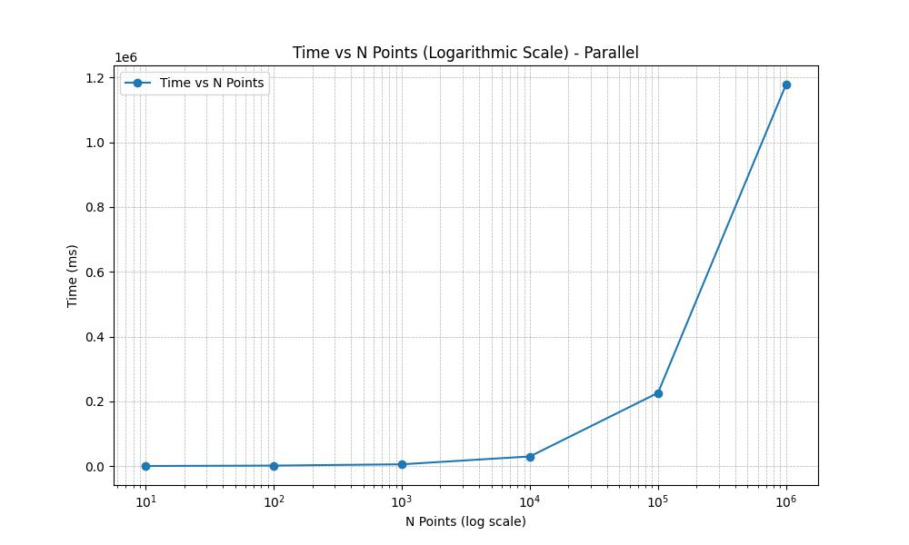
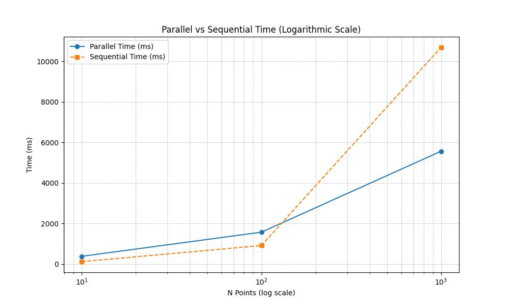
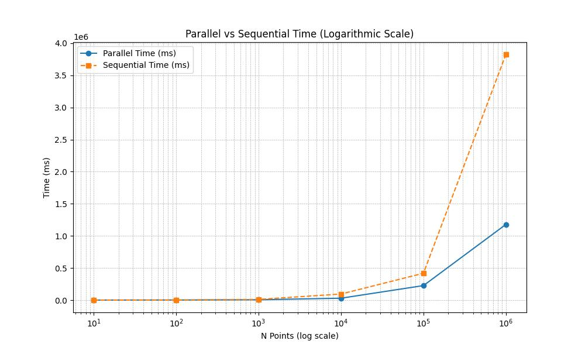

# Randomized Incremental Convex Hull Visualization

This utility sends a convex hull's points and edges to a Python server for real-time visualization using HTTP.

## Prerequisites

Make sure you have the following installed on your system:

1. **C++ Compiler**: GCC or Clang with C++20 support.
2. **libcurl**: Library for HTTP requests.
3. **JsonCpp**: Library for JSON handling.

### MacOS
```bash
brew install libcurl jsoncpp
```

### Ubuntu/Debian
```bash
sudo apt-get install libcurl4-openssl-dev libjsoncpp-dev
```

---

## Setting Up the Project

1. Clone the repository or copy the code.

---

## Compilation

Use cmake and clion to compile the code.

---

## Running the Code

1. **Start the Python Visualization Server**:
    - Run the Flask server on port `8000`.
    - Use the provided `visualize_hull.py` script.

   Example command to start the server:
   ```bash
   python visualize_hull.py
   ```

2. **Run the C++ Utility**:
    - Execute the compiled binary to send points and edges.

---

## How It Works

1. The Python server listens for POST requests on `http://127.0.0.1:8000/update`.
2. The C++ utility sends the graph (points and hull edges) as JSON data to the server.
3. The server updates the visualization in real-time.

---

## Example Output

- The Python server visualizes the convex hull dynamically as new data is sent.

## Results

Primero ejecutamos 3 veces los códigos y sacamos el tiempo medio de las 3 ejecuciones para luego graficarlo:

### Tabla de ejecuciones para el algoritmo secuencial

| N Points  | Ejecucion 1 | Ejecucion 2 | Ejecucion 3 | Time(ms) |
|-----------|-------------|-------------|-------------|----------|
| 10        | 100         | 158         | 84          | 114      |
| 100       | 858         | 1001        | 865         | 908      |
| 1000      | 10928       | 9430        | 11689       | 10682    |
| 10000     | 118098      | 103488      | 62687       | 94758    |
| 100000    | 519265      | 324781      | 411211      | 418419   |
| 1000000   | 5071498     | 3263971     | 3143741     | 3826403  |

### Gráfico


### Tabla de ejecuciones para el algoritmo paralelo

| N Points  | Ejecucion 1 | Ejecucion 2 | Ejecucion 3 | Time(ms) |
|-----------|-------------|-------------|-------------|----------|
| 10        | 318         | 473         | 337         | 376      |
| 100       | 1791        | 1588        | 1322        | 1567     |
| 1000      | 5378        | 6149        | 5152        | 5560     |
| 10000     | 31192       | 31069       | 27032       | 29764    |
| 100000    | 217987      | 230030      | 230505      | 226174   |
| 1000000   | 1267852     | 1188519     | 1079041     | 1178471  |

### Gráfico



### Comparación final

Vamos a empezar graficando cómo varian los tiempos hasta 1000 puntos.



Notamos que al inicio el algoritmo paralelo demora más en ejecutar. Pero qué sucederá para más de 1000 puntos?



Se nota claramente que el algoritmo paralelo es mucho mejor cuando hablamos de muchos números.